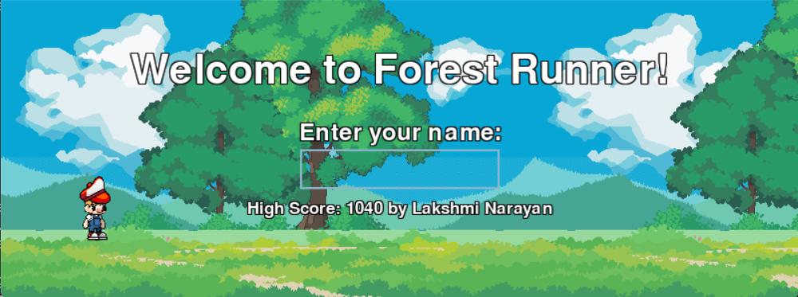

# Forest Runner

A colorful side-scrolling platformer inspired by Google Chrome's Dino game, featuring a boy running through a vibrant forest landscape.



## Description

Forest Runner is an endless runner game where you control a character navigating through a forest environment, jumping over obstacles to achieve the highest score possible. The game features parallax scrolling backgrounds, fluid character animations, and an immersive audio experience.

## Features

- **Endless Runner Gameplay**: Test your reflexes as you jump over obstacles in an ever-accelerating game environment
- **Parallax Backgrounds**: Multi-layered forest backgrounds create a sense of depth and immersion
- **Character Animations**: Fluid animations for idle, running, and jumping states
- **Audio System**: Background music and sound effects enhance the gaming experience
- **High Score System**: Compete against yourself and others with a persistent high score system
- **Polished UI**: Clean, readable interface with start screen, game over screen, and score display

## Installation

### Prerequisites

- Python 3.6 or higher
- Pygame library

### Setup

1. Clone the repository:
```
git clone https://github.com/yourusername/forest-runner.git
cd forest-runner
```

2. Install the required dependencies:
```
pip install pygame
```

3. Run the game:
```
python forest_runner.py
```

## How to Play

- **Start Game**: Enter your name and press SPACE to begin
- **Jump**: Press SPACE to jump over obstacles
- **Restart**: Press R after game over to restart
- **Change Player**: Press N after game over to change player name
- **Audio Controls**: 
  - Press M to toggle music on/off
  - Press + or - to adjust music volume

## Project Structure

```
forest-runner/
├── forest_runner.py     # Main game file
├── audio_manager.py     # Audio management system
├── audio/               # Directory containing audio files
│   ├── game_bgm.mp3     # Background music
│   ├── 8-bit-jump.mp3   # Jump sound effect
│   └── game-over.mp3    # Game over sound effect
├── hero/                # Character sprite images
│   ├── Idle (1-10).png  # Idle animation frames
│   ├── Run (1-8).png    # Running animation frames
│   └── Jump (1-12).png  # Jumping animation frames
├── backgrounds/         # Background image layers
│   ├── sky.png
│   ├── clouds.png
│   ├── hills.png
│   ├── trees.png
│   └── ground.png
├── obstacles/           # Obstacle images
│   └── Rock(1-4).png    # Various rock obstacles
├── high_score.txt       # High score data file
└── README.md            # This file
```

## Development

This game was developed entirely with the assistance of Amazon Q Developer, AWS's AI coding assistant. The development process included:

1. Setting up the basic game structure
2. Implementing character controls and animations
3. Creating parallax scrolling backgrounds
4. Adding obstacles and collision detection
5. Implementing the scoring and high score system
6. Adding audio and UI elements

Even this README file was created with Amazon Q Developer's assistance!

## Future Improvements

- Mobile support with touch controls
- Additional character options
- Power-ups and special abilities
- Different environments/themes
- Difficulty levels

## Credits

- Game developed with assistance from [Amazon Q Developer](https://aws.amazon.com/q/)
- Character sprites, background assets, and audio from royalty-free sources

## License

This project is licensed under the MIT License - see the LICENSE file for details.
